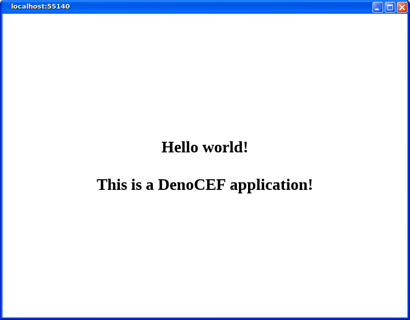

# DenoCEF - The Chromium Embedded Framework for Deno

DenoCEF is a project that aims to use both the Chromium Embedded Framework and Deno to create sandboxed cross-platform GUI applications. It works by packaging modified precompiled binaries of the Chromium Embedded Framework along with the Deno runtime, as well as an API to interact with the two.


## How does it work?

DenoCEF works by using CEF as a front-end to a Deno web server running on the local host as a back-end. CEF, being web browser based, has many sandboxed features that make it secure on the front-end, and Deno, due to the default security features design, has its own sandbox that prevents an embedded server back-end from accessing resources unless explicitly specified. As a result of these sandboxing features, DenoCEF is flexible in which web server you chose to run, allowing you to use virtually any framework available for Deno.

For additional information and a more in-depth tutorial, you can read my article [here](https://denotutorials.net/making-desktop-gui-applications-ii-using-denocef-electric-and-yolk.html).


## Getting Started

__*Before getting started, it is recommended your computer have at least 5 GB of space and 3.5 GB of available RAM when creating new DenoCEF projects for the first time to ensure everything runs properly*__

The DenoCEF repo contains a CLI tool, called **Electric**, which allows you to easy create and package DenoCEF applications. It is the recommended way of using DenoCEF. Electric can be downloaded and installed with the followng command:

```
deno install -A -f --unstable https://raw.githubusercontent.com/denjucks/deno-cef/master/electric.js
```

Once installed, you can create a new DenoCEF project in the current directory with the following command:

```
electric create
```

The first time you run this command, it will take a while for it to finish running, as this command will fetch a precompiled binary for your platform, decompress it, unarchive it, cache it, and then copy it from the cache to your local directory. Due to The next time you run this command it will run much faster as it will simply use a copy of DenoCEF from the cache.

Once the project is created, you can run the following command to run DenoCEF:

**Windows**
```
run.vbs
```

**Linux**
```
# Note before running you need use chmod to make this command executable. You also
# need to change the ownership of chrome-sandbox to the root account, which can be
# done by running the grant-permissions.sh file with this command:
#
#   ./grant-permissions.sh root
#
./run
```

It will open up a window like this with your CEF instance communicating with your Deno server:




## Understanding the architecture

You'll notice 2 JavaScript files in the project directory, **app.js** and **server.js**. The app.js file contains configurations for your DenoCEF application:

```javascript
import { Cef } from "./denocef/cef.js";

let cefapp = new Cef({
    urlPath: "/",
});

await cefapp.run();
```

A list of configurations for your DenoCEF applications include the following:

* **urlPath**: The entry point URL path of your Deno server. This will be the URL that the DenoCEF application first connects to when it starts. For example, if you want your DenoCEF application to connect to the URL `http://localhost:port/main` when it starts, you can set the urlPath to `/main`.
* **width**: The width, in pixels, of the CEF instance. By default this is set to `800`.
* **height**: The height, in pixels, of the CEF instance. By default this is set to `600`.
* **x**: The starting x position of the CEF instance. By default this is set to `0`.
* **y**: The starting y position of the CEF instance. By default this is set to `0`.
* **port**: The port the Deno server will use. By default this port is randomized, but you can also set a specific port.
* **remoteDebuggingPort**: This is the port set for the CEF remote debugger. By default this is set to `44444`.
* **denoPermissions**: An array of permissions that the Deno server will have. This array takes the same flags as deno executable, which can be found [here](https://deno.land/manual/getting_started/permissions). Note that some flags are disabled by the DenoCEF API. For example, DenoCEF does not allow the usage of the `--allow-all` (or `-A`) flag. Additionally, DenoCEF always includes the `--allow-net=localhost,0.0.0.0` flags so that you can run your web server on the localhost.
* **serverFilePath**: The path to the entry point server file. By default this is set to look for the file `server.js` in the current directory.

The other file, server.js, simply contains a basic Oak web server:

```javascript
import { Application } from "https://deno.land/x/oak/mod.ts";

const app = new Application();

app.use((ctx) => {
  ctx.response.body = "<html><body style='display: flex'><h1 style='margin: auto; text-align: center'>Hello world!<br><br>This is a DenoCEF application!</h1></body></html>";
});

// Include a command line argument to pick the port, as DenoCef uses this
// command for the Cef.
await app.listen({ 
  port: Number.parseFloat(Deno.args[0]) 
});
```

One thing to note is that you should allow DenoCEF to pass a port to your web server via the first argument in Deno.args (`Deno.args[0]`). Besides this one feature, there is nothing special about the choice of web server, and virtually any Deno web server can be used here, such as [Alosaur](https://deno.land/x/alosaur), [Pogo](https://deno.land/x/pogo), [Aqua](https://deno.land/x/aqua), [Attain](https://deno.land/x/attain), etc.


## Packaging your application

To package your application you can run the following command:

```
electric package
```

This will take your entire deno cache and package it into the application. **Make sure you clear your deno cache and refresh it with only the libraries needed to run your application**, or else libraries within the cache that you may not want to share (such as internal libraries) will be erroneously included within the cache. You clear the cache by deleting all the files in `%LOCALAPPDATA%\deno` on Windows or `$HOME/.cache/deno` on Linux. You can then refresh the cache by running your server with the following command:

```
deno cache server.js
```

The end result from the packaging will be a single folder that you can zip, compress, and send to a different machine.


## Todo

#### Electric

- [ ] Refactor the Electric CLI.
- [ ] Add compression and archiving to the package command.
- [ ] Improve the ability to target specific platforms.
- [ ] Add a command to make and package for all platforms at once.

#### Windows Platform

- [x] Compile DenoCEF binaries for Windows and include them in the repo.
- [ ] Add the option to change the width and height of the window (currently doesn't seem to work).
- [ ] Add the option to set the x and y coordinates of the window (currently doesn't seem to work).
- [ ] Add the option to set resizability of the window.
- [ ] Add the option to create frameless windows.
- [ ] Add the option to allow in-browser debugging.
- [x] Add the option to use remote debugging.

#### Linux Platform

- [x] Compile DenoCEF binaries for Linux and include them in the repo.
- [x] Add the option to change the width and height of the window.
- [x] Add the option to set the x and y coordinates of the window.
- [ ] Add the option to set resizability of the window.
- [ ] Add the option to create frameless windows.
- [ ] Add the option to allow in-browser debugging.
- [x] Add the option to use remote debugging.

#### MacOS Platform

- [ ] Compile DenoCEF binaries for MacOS and include them in the repo.
- [ ] Add the option to change the width and height of the window.
- [ ] Add the option to set the x and y coordinates of the window.
- [ ] Add the option to set resizability of the window.
- [ ] Add the option to create frameless windows.
- [ ] Add the option to allow in-browser debugging.
- [ ] Add the option to use remote debugging.


## Licenses

### DenoCEF License

MIT License

Copyright (c) 2020 Anthony Mancini

Permission is hereby granted, free of charge, to any person obtaining a copy of this software and associated documentation files (the "Software"), to deal in the Software without restriction, including without limitation the rights to use, copy, modify, merge, publish, distribute, sublicense, and/or sell copies of the Software, and to permit persons to whom the Software is furnished to do so, subject to the following conditions:

The above copyright notice and this permission notice shall be included in all copies or substantial portions of the Software.

THE SOFTWARE IS PROVIDED "AS IS", WITHOUT WARRANTY OF ANY KIND, EXPRESS OR IMPLIED, INCLUDING BUT NOT LIMITED TO THE WARRANTIES OF MERCHANTABILITY, FITNESS FOR A PARTICULAR PURPOSE AND NONINFRINGEMENT. IN NO EVENT SHALL THE AUTHORS OR COPYRIGHT HOLDERS BE LIABLE FOR ANY CLAIM, DAMAGES OR OTHER LIABILITY, WHETHER IN AN ACTION OF CONTRACT, TORT OR OTHERWISE, ARISING FROM, OUT OF OR IN CONNECTION WITH THE SOFTWARE OR THE USE OR OTHER DEALINGS IN THE SOFTWARE.


### Chromium Embedded Framework License

// Copyright (c) 2008-2020 Marshall A. Greenblatt. Portions Copyright (c)
// 2006-2009 Google Inc. All rights reserved.
//
// Redistribution and use in source and binary forms, with or without
// modification, are permitted provided that the following conditions are
// met:
//
//    * Redistributions of source code must retain the above copyright
// notice, this list of conditions and the following disclaimer.
//    * Redistributions in binary form must reproduce the above
// copyright notice, this list of conditions and the following disclaimer
// in the documentation and/or other materials provided with the
// distribution.
//    * Neither the name of Google Inc. nor the name Chromium Embedded
// Framework nor the names of its contributors may be used to endorse
// or promote products derived from this software without specific prior
// written permission.
//
// THIS SOFTWARE IS PROVIDED BY THE COPYRIGHT HOLDERS AND CONTRIBUTORS
// "AS IS" AND ANY EXPRESS OR IMPLIED WARRANTIES, INCLUDING, BUT NOT
// LIMITED TO, THE IMPLIED WARRANTIES OF MERCHANTABILITY AND FITNESS FOR
// A PARTICULAR PURPOSE ARE DISCLAIMED. IN NO EVENT SHALL THE COPYRIGHT
// OWNER OR CONTRIBUTORS BE LIABLE FOR ANY DIRECT, INDIRECT, INCIDENTAL,
// SPECIAL, EXEMPLARY, OR CONSEQUENTIAL DAMAGES (INCLUDING, BUT NOT
// LIMITED TO, PROCUREMENT OF SUBSTITUTE GOODS OR SERVICES; LOSS OF USE,
// DATA, OR PROFITS; OR BUSINESS INTERRUPTION) HOWEVER CAUSED AND ON ANY
// THEORY OF LIABILITY, WHETHER IN CONTRACT, STRICT LIABILITY, OR TORT
// (INCLUDING NEGLIGENCE OR OTHERWISE) ARISING IN ANY WAY OUT OF THE USE
// OF THIS SOFTWARE, EVEN IF ADVISED OF THE POSSIBILITY OF SUCH DAMAGE.


### Deno License

MIT License

Copyright (c) 2018-2020 the Deno authors

Permission is hereby granted, free of charge, to any person obtaining a copy
of this software and associated documentation files (the "Software"), to deal
in the Software without restriction, including without limitation the rights
to use, copy, modify, merge, publish, distribute, sublicense, and/or sell
copies of the Software, and to permit persons to whom the Software is
furnished to do so, subject to the following conditions:

The above copyright notice and this permission notice shall be included in all
copies or substantial portions of the Software.

THE SOFTWARE IS PROVIDED "AS IS", WITHOUT WARRANTY OF ANY KIND, EXPRESS OR
IMPLIED, INCLUDING BUT NOT LIMITED TO THE WARRANTIES OF MERCHANTABILITY,
FITNESS FOR A PARTICULAR PURPOSE AND NONINFRINGEMENT. IN NO EVENT SHALL THE
AUTHORS OR COPYRIGHT HOLDERS BE LIABLE FOR ANY CLAIM, DAMAGES OR OTHER
LIABILITY, WHETHER IN AN ACTION OF CONTRACT, TORT OR OTHERWISE, ARISING FROM,
OUT OF OR IN CONNECTION WITH THE SOFTWARE OR THE USE OR OTHER DEALINGS IN THE
SOFTWARE.